# 🔧 Repositorio de Tareas del Curso de Frontend 🔧

Bienvenido a mi repositorio donde iré subiendo las tareas realizadas durante mi curso de Frontend. Este archivo README se actualizará constantemente con cada nueva tarea completada.

## 📝 Tabla de Contenidos
- [🔧 Repositorio de Tareas del Curso de Frontend 🔧](#-repositorio-de-tareas-del-curso-de-frontend-)
  - [📝 Tabla de Contenidos](#-tabla-de-contenidos)
  - [💼 Tareas Completadas](#-tareas-completadas)
  - [MODULO 1](#modulo-1)
  - [MODULO 1](#modulo-1-1)
  - [🔧 Instrucciones](#-instrucciones)
  - [📢 Contacto](#-contacto)

## 💼 Tareas Completadas

## MODULO 1

| 📚 **Tarea** | 📍 **Link** | 🔍 **Descripción** | 🖼️ **Imagen** |
|----------------|---------|-------------------|--------------------|
| Tarea 1 | [Ver aquí](https://github.com/JoryerJL/Course-Frontend-Projects/blob/main/Clase1/tiposDeDatos.js) | Tipos de datos |  |
| Tarea 2 | [Ver aquí](https://github.com/JoryerJL/Course-Frontend-Projects/blob/main/Clase2/sentenciaDeControl.js) | Sentencias de control | 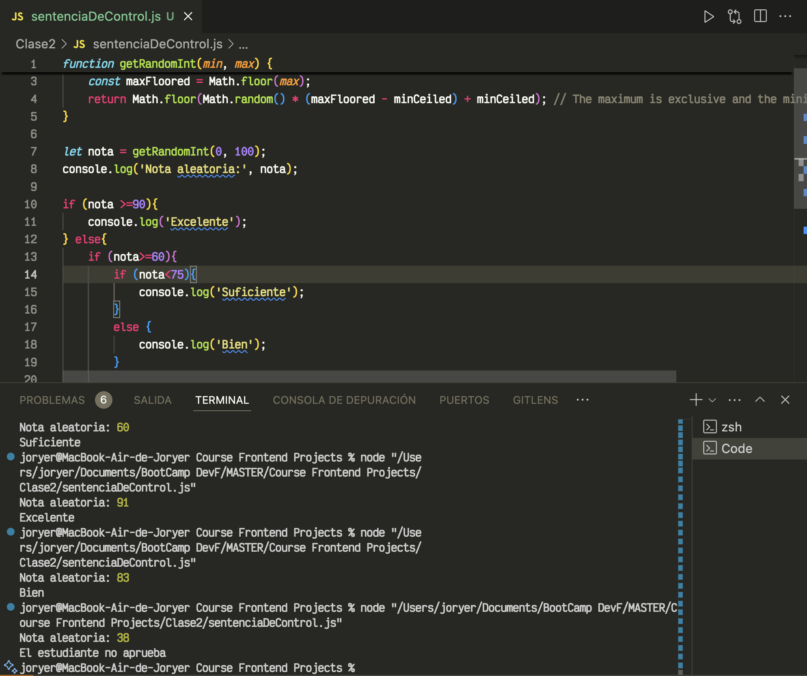 |
| Tarea 3 | [Ver aquí](https://github.com/JoryerJL/Course-Frontend-Projects/blob/main/Clase3/Ciclos.js) | Ciclos | 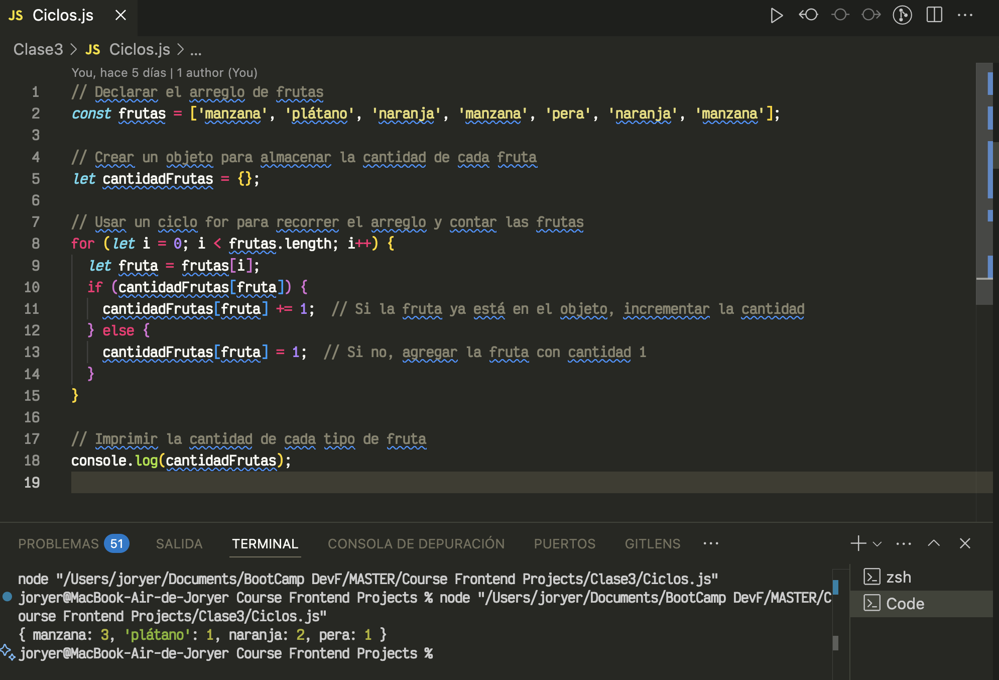 |
| Tarea 4 | [Ver aquí](https://github.com/JoryerJL/Course-Frontend-Projects/blob/main/Clase4/funciones.js) | Funciones | 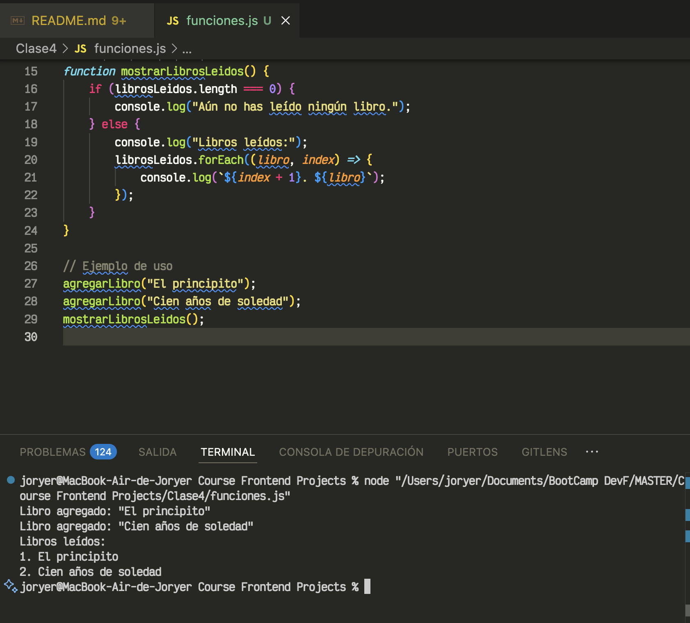 |
| Tarea 5 | [Ver aquí](https://github.com/JoryerJL/Course-Frontend-Projects/tree/main/Clase5) | Objetos | 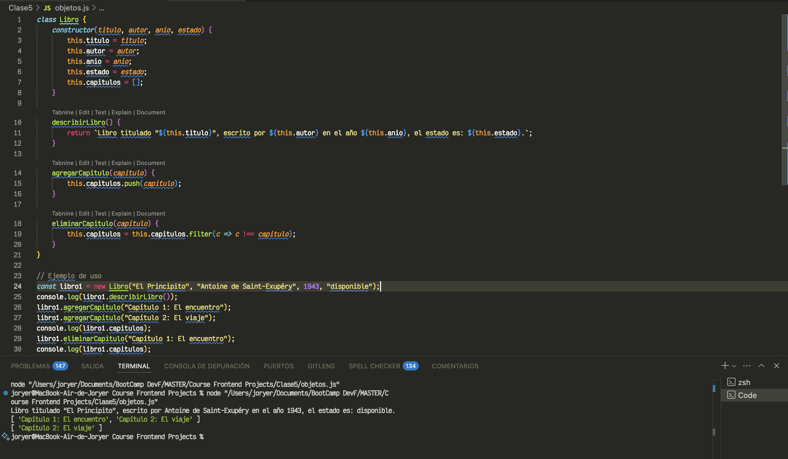 |
| Tarea 6 | [Ver aquí](https://github.com/JoryerJL/Course-Frontend-Projects/tree/main/Clase6) | DOM | 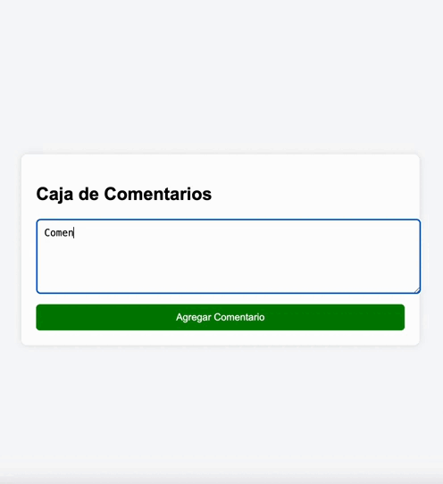 |
| Tarea 7 | [Ver aquí](https://github.com/JoryerJL/Course-Frontend-Projects/tree/main/Clase7) | Generador de Passwords | 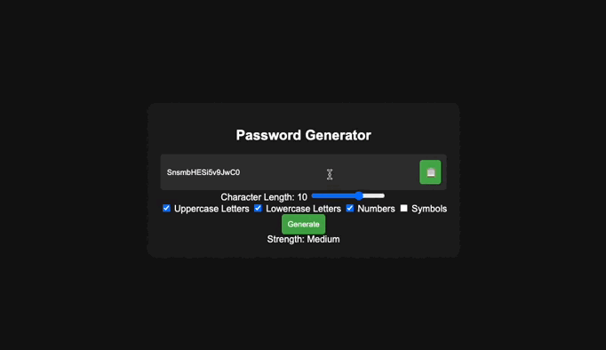 |
| Proyecto Integrador | [Ver aquí](https://github.com/JoryerJL/Course-Frontend-Projects/tree/main/ProyectoIntegrador) | Proyecto Integrador |  |

## MODULO 1

| 📚 **Tarea** | 📍 **Link** | 🔍 **Descripción** | 🖼️ **Imagen** |
|----------------|---------|-------------------|--------------------|
| Tarea 1 | [Ver aquí](https://github.com/JoryerJL/Course-Frontend-Projects/blob/main/Modulo2/Clase1) | ECMAScript | 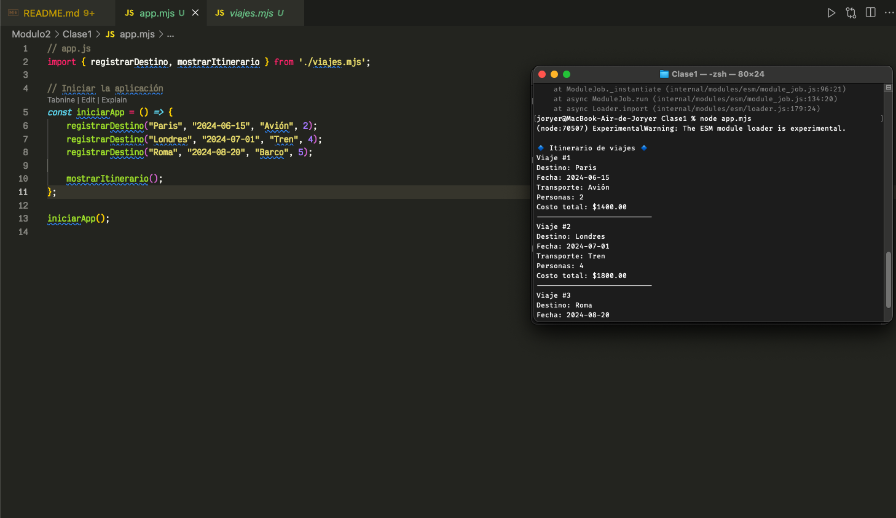 |
| Tarea 2 | [Ver aquí](https://github.com/JoryerJL/Course-Frontend-Projects/blob/main/Modulo2/Clase2) | Estructura de Datos | 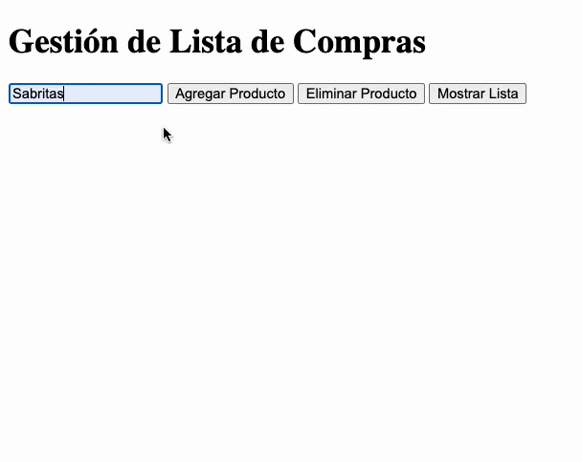 |
| Tarea 3 | [Ver aquí](https://github.com/JoryerJL/Course-Frontend-Projects/blob/main/Modulo2/Clase3) | Métodos de Arreglos | 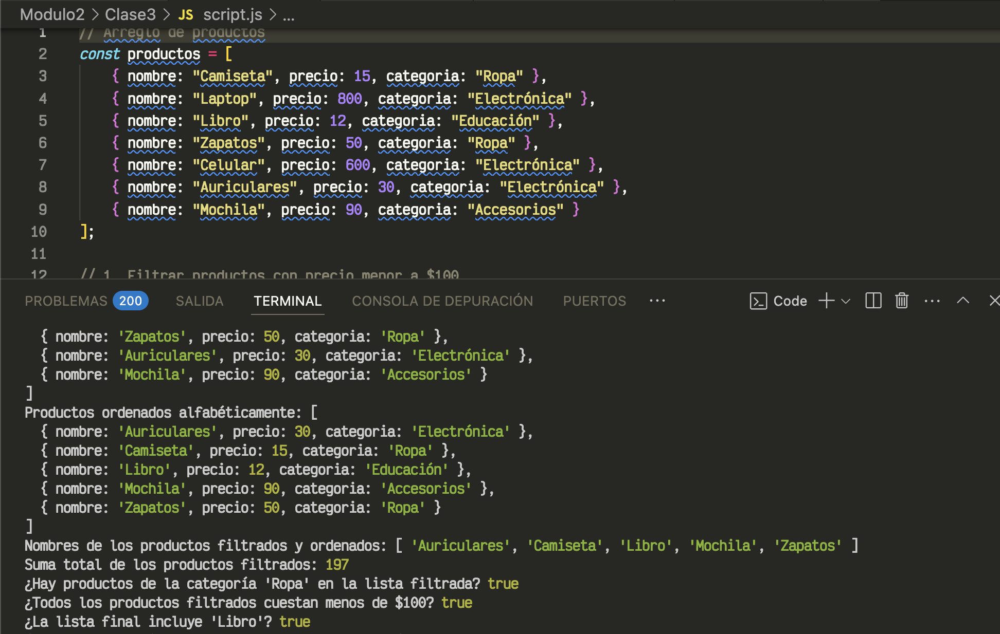 |
| Tarea 4 | [Ver aquí](https://github.com/JoryerJL/Course-Frontend-Projects/blob/main/Modulo2/Clase4) | Punteros | 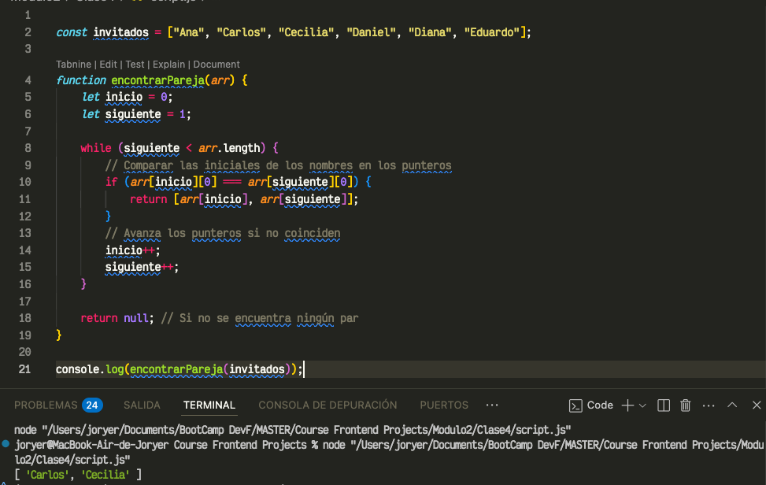 |
| Tarea 5 | [Ver aquí](https://github.com/JoryerJL/Course-Frontend-Projects/blob/main/Modulo2/Clase5) | Sliding Window | 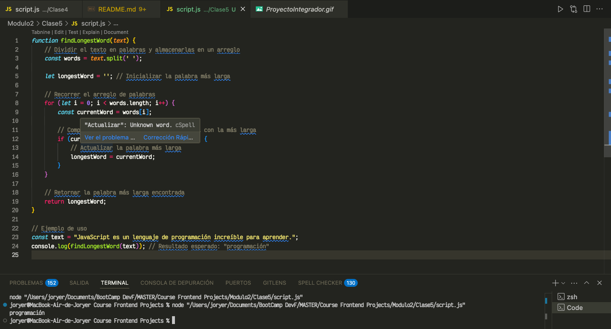 |
| Tarea 6 | [Ver aquí](https://github.com/JoryerJL/Course-Frontend-Projects/blob/main/Modulo2/Clase6) | Recursion y backtracking | 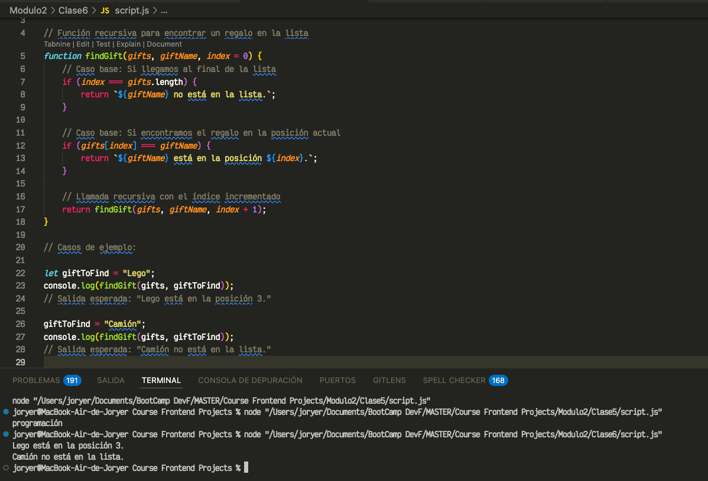 |
| Tarea 7 | [Ver aquí](https://github.com/JoryerJL/Course-Frontend-Projects/blob/main/Modulo2/Clase7) | Divide y Vencerás | 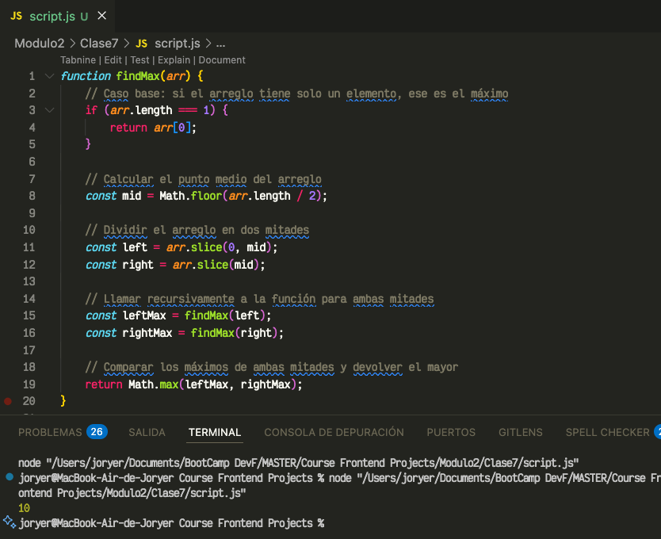 |
| Tarea 8 | [Ver aquí](https://github.com/JoryerJL/Course-Frontend-Projects/blob/main/Modulo2/Clase8) | Manejo de archivos con Node.js | 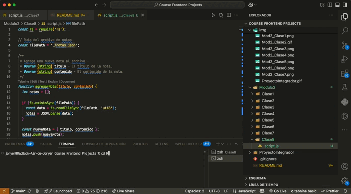 |
| Tarea 9 | [Ver aquí](https://github.com/JoryerJL/Course-Frontend-Projects/blob/main/Modulo2/Clase9) | Event Loopp y Asincronicidad | 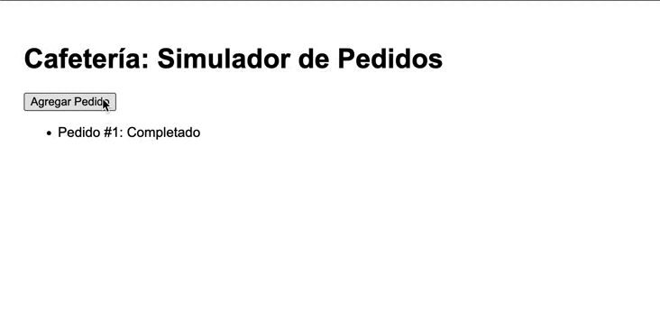 |
| Tarea 10 | [Ver aquí](https://github.com/JoryerJL/Course-Frontend-Projects/blob/main/Modulo2/Clase10) | Callbacks and JSON | 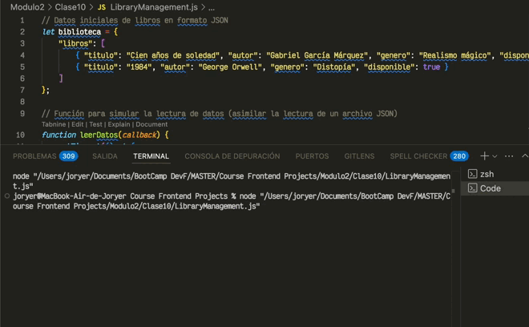 |
| Tarea 11 | [Ver aquí](https://github.com/JoryerJL/Course-Frontend-Projects/blob/main/Modulo2/Clase11) | Fetch y Axios | 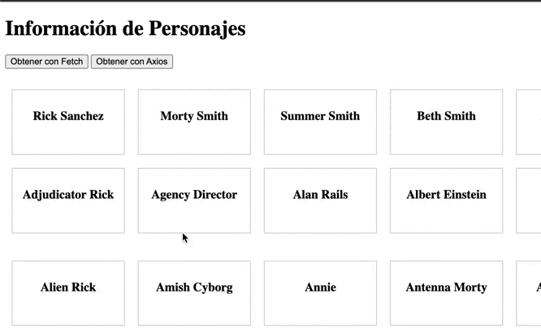 |
| Tarea 12 | [Ver aquí](https://github.com/JoryerJL/Course-Frontend-Projects/blob/main/Modulo2/Clase12) | Promesas y Async/Await | 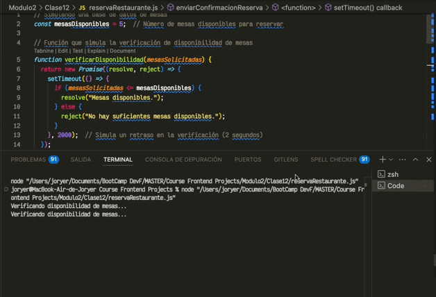 |
| Tarea 13 | [Ver aquí](https://github.com/JoryerJL/Course-Frontend-Projects/blob/main/Modulo2/Clase13) | Manejo de Formularios | 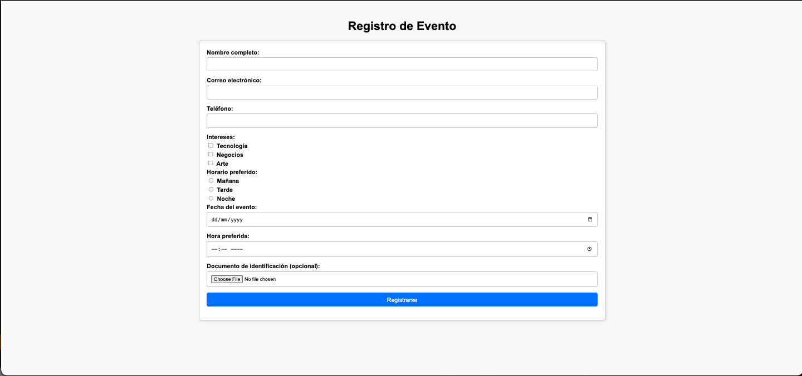 |
| Tarea 14 | [Ver aquí](https://github.com/JoryerJL/Course-Frontend-Projects/blob/main/Modulo2/Clase14) | Validación de formularios con Zod | 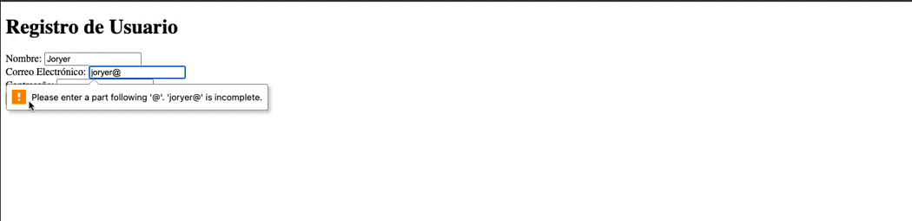 |
| Tarea 15 | [Ver aquí](https://github.com/JoryerJL/Course-Frontend-Projects/blob/main/mi-exploracion-espacial) | Intro a Node.js y npm | 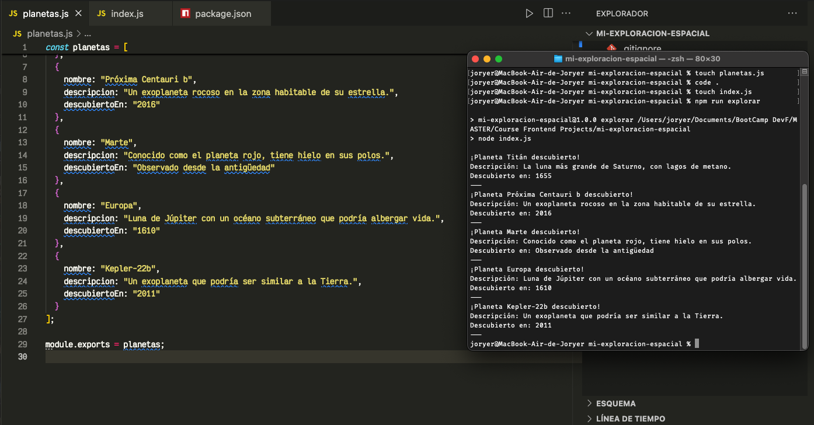 |
## 🔧 Instrucciones
1. Clona el repositorio:
    ```bash
    git clone https://github.com/JoryerJL/Course-Frontend-Projects.git
    ```

## 📢 Contacto
Si tienes alguna duda o sugerencia, no dudes en contactarme:
- Email: [joryerjesus10@gmail.com](mailto:joryerjesus10@gmail.com)
- LinkedIn: [Mi Perfil](https://www.linkedin.com/in/joryer-jimenez-563a3b171/)

💪🚀 Gracias por visitar mi repositorio. Espero que encuentres útil este contenido para tu aprendizaje o inspiración..


